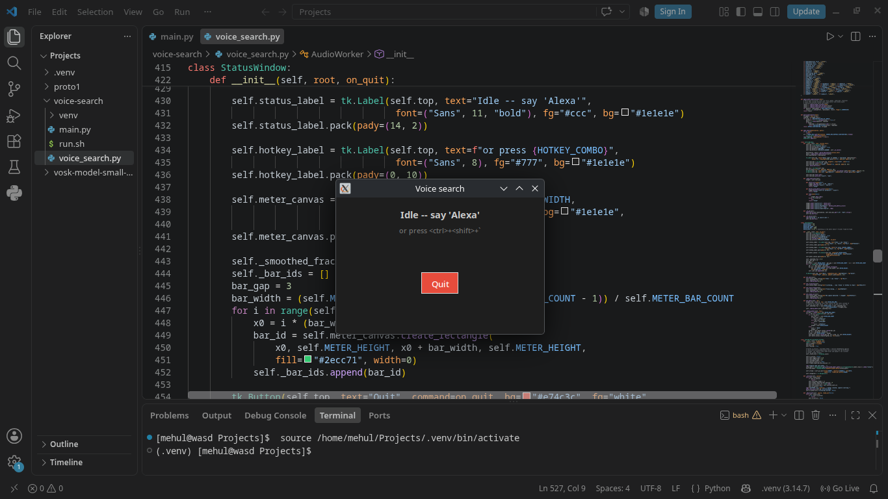
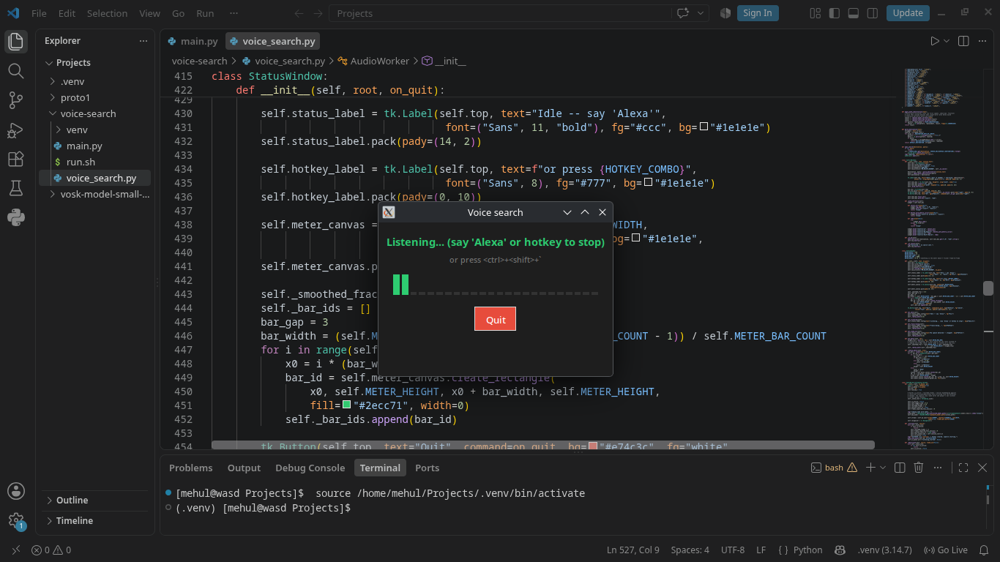
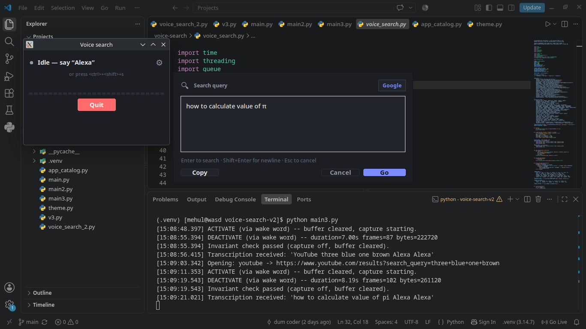
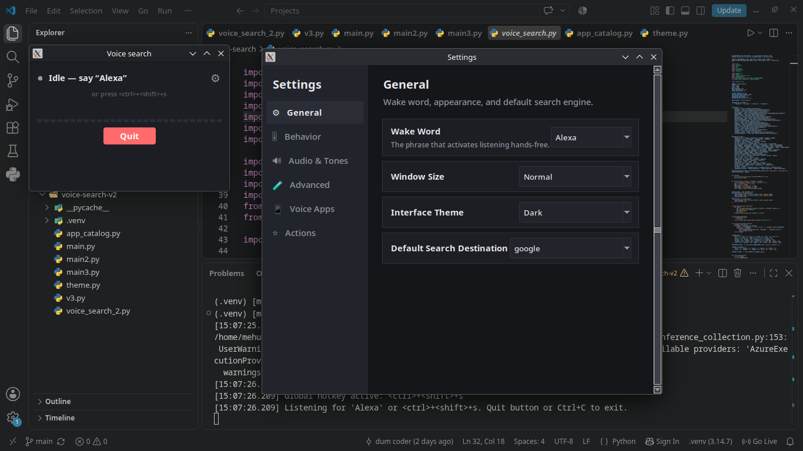
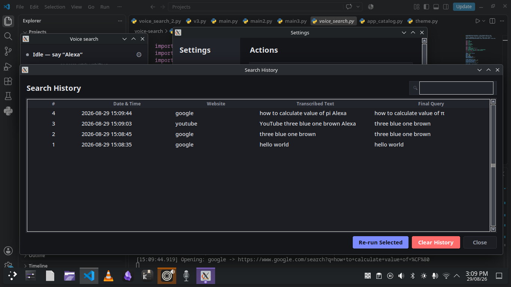

# Voice Search Launcher

[](https://www.python.org/)
[](#prerequisites)
[](#how-it-works)
[](#tech-stack)

A small desktop voice-to-search and app-launcher, written in Python.

Say **"Alexa"** or press **Ctrl + Shift + `**, speak a search query, review the transcription, and open the search in your preferred destination. You can also say **"open \<app name\>"** to launch a local application instead.

> **Speak → Review → Search (or launch).**
>
> That's pretty much the whole idea.

---

## About

This is a personal project built while I am still learning programming.

I'm a **beginner developer**, so this project is definitely not perfect. There are probably bugs, questionable design decisions, code that could be cleaner, and things that experienced developers will immediately notice.

That's part of why I'm putting it on GitHub.

If you find something that is broken, inefficient, unnecessarily complicated, or just plain stupid, **feel free to open an issue or submit a pull request.** I'm here to learn.

And if you see something in the code and think:

> "Why on Earth did he do it this way?"

There is a reasonable chance I asked myself the same question three weeks later.

Constructive feedback is very welcome.

---

## Screenshots

### Idle



### Listening



### Confirm Search



### Settings



### Search History



---

## Features

- **Wake-word activation** using `openWakeWord`
- **Global hotkey activation** with `pynput`
- **Local microphone capture** using PyAudio
- **Speech transcription** using Google Web Speech through `SpeechRecognition`
- **Editable transcription** before searching, in a command-palette style confirm window
- **Voice-launchable local applications** — say "open \<app name\>" instead of searching
- **Silence timeout** when no speech is detected
- **Audio level meter** while recording
- **Activation and deactivation sounds**, with multiple selectable tone themes
- **Multiple search destinations**
- **Spoken mathematical notation conversion**
- **Destination aliases** designed for natural speech
- **Search history**, with a searchable/filterable log of past queries
- **Dark and light interface themes**, applied consistently across every window
- **Configurable settings window** (wake word, window size, sensitivity, hotkey, and more) — no need to edit the source
- **Background transcription** so the GUI remains responsive
- **Thread-safe recording state**
- **Explicit audio-boundary checks** around recording sessions
- **Timestamped runtime logging**

---

## What It Does

The application runs in the background and waits for either:

1. The wake word **"Alexa"**
2. The global hotkey **Ctrl + Shift + `**

Once activated, the application starts buffering microphone audio.

You can then speak a query such as:

```
google python decorators
```

or:

```
youtube how to learn C++
```

or:

```
desmos x squared plus y squared equals 25
```

or launch a local application instead of searching:

```
open visual studio code
```

```
open obsidian
```

When recording stops, the captured audio is sent to Google's speech-recognition service for transcription.

If the transcript matches an "open \<app\>" phrase and app launching is enabled, the application is launched directly and no search happens. Otherwise, the resulting text is displayed in a confirmation window where you can edit it before clicking **Go**.

No magic. No giant AI framework. Just a microphone, some Python, several threads, and the occasional bug.

---

## How It Works

The application is split into a few simple stages:

```
             ┌──────────────────┐
             │    Microphone    │
             └────────┬─────────┘
                      │
                      ▼
             ┌──────────────────┐
             │     PyAudio      │
             │   16 kHz / PCM   │
             └────────┬─────────┘
                      │
         ┌────────────┴────────────┐
         │                         │
         ▼                         ▼
┌─────────────────┐       ┌─────────────────┐
│  openWakeWord   │       │  Active session │
│  local detection│       │  audio buffer   │
└────────┬────────┘       └────────┬────────┘
         │                         │
         │ activate                │ deactivate
         └────────────┬────────────┘
                      ▼
             ┌──────────────────┐
             │ SpeechRecognition│
             │ / Google Web     │
             │ Speech           │
             └────────┬─────────┘
                      │
                      ▼
             ┌──────────────────┐
             │ Transcript +     │
             │ math processing  │
             └────────┬─────────┘
                      │
             ┌────────┴─────────┐
             │                  │
             ▼                  ▼
   ┌──────────────────┐ ┌──────────────────┐
   │ "open <app>"     │ │ Confirmation     │
   │ → App Launcher   │ │ Window           │
   └──────────────────┘ └────────┬─────────┘
                                 │
                                 ▼
                        ┌───────────────────┐
                        │   Web Browser     │
                        │ Search Destination│
                        └───────────────────┘
```

The wake-word detection happens locally through `openWakeWord`.

The Google speech-recognition request happens later, after a recording session has ended.

---

## Audio Handling

The application intentionally separates wake-word detection from transcription.

While idle, the microphone stream is read for wake-word detection.

When a session is activated, audio frames are added to the recording buffer.

When the session is deactivated:

1. `is_active` is set to `False`.
2. The current recording buffer is detached from the capture state.
3. The active recording buffer is cleared.
4. The capture loop can no longer append to that detached buffer.
5. The detached audio is passed to the transcription thread.

The code also performs explicit runtime checks after deactivation to verify:

```
is_active == False
recorded_frames == []
```

This is intentional rather than relying on Python's `assert` statement, and the check is performed against a snapshot of the state taken while the lock protecting it is still held, so the verification is accurate even under concurrent access.

The application also logs capture, hand-off, and transcription events with timestamps.

The goal is to make the audio boundary clear:

**idle audio is used for local wake-word detection; an actual recording session is what gets passed to the transcription service.**

---

## Search Destinations

Queries can optionally start with a destination keyword.

| Destination                | Example                               |
| -------------------------- | ------------------------------------- |
| Google                     | `google python threading`             |
| Wikipedia                  | `wikipedia Alan Turing`               |
| YouTube                    | `youtube python tutorials`            |
| WolframAlpha               | `wolfram alpha integral x squared`    |
| Khan Academy               | `khan academy calculus`               |
| GeeksforGeeks              | `geeks for geeks binary search`       |
| Desmos                     | `desmos x squared plus y squared`     |
| Paul's Notes               | `pauls notes differential equations`  |
| Math Stack Exchange        | `math stack exchange eigenvalues`     |
| Physics Stack Exchange     | `physics stack exchange relativity`   |
| Electronics Stack Exchange | `electronics stack exchange op amp`   |
| MIT OpenCourseWare         | `mit ocw linear algebra`              |
| arXiv                      | `arxiv transformer architecture`      |
| Symbolab                   | `symbolab quadratic equation`         |
| MathWorld                  | `mathworld Fourier transform`         |
| IEEE Xplore                | `ieee machine learning`               |
| Coursera                   | `coursera python course`              |
| GitHub                     | `github tkinter projects`             |
| Stack Overflow             | `stackoverflow python threading`      |
| Octopart                   | `octopart LM358`                      |
| All About Circuits         | `all about circuits transistor`       |
| Engineering Toolbox        | `engineering toolbox reynolds number` |

This is a representative sample — the full list is considerably longer and covers electronics, EDA, PCB manufacturing, datasheets, and academic/research destinations as well. The complete, up-to-date list lives in `SEARCH_URLS` and `DESTINATION_ALIASES` in the source.

If no destination is specified, **Google** is used.

### Examples

```
python list comprehensions
```

Searches Google.

```
youtube python tkinter tutorial
```

Searches YouTube.

```
github open source voice assistant
```

Searches GitHub.

```
wikipedia Nikola Tesla
```

Searches Wikipedia.

---

## Voice-Launchable Applications

Instead of searching, you can say "open", "launch", "start", "run", or "fire up" followed by an app name, and the application will attempt to launch it locally rather than opening a browser.

```
open visual studio code
```

```
open the file manager
```

```
launch obsidian
```

```
fire up spotify
```

Small filler words such as "the", "a", "an", "my", and "up" are stripped automatically, so natural phrasing like "open up obsidian" or "open the file manager" resolves correctly.

Applications are grouped into categories:

| Category            | Examples                                                  |
| -------------------- | --------------------------------------------------------- |
| Development           | VS Code, PyCharm, IntelliJ, Docker, GitHub Desktop, Terminal |
| Design & Media        | GIMP, Inkscape, Blender, Figma, OBS Studio, Spotify        |
| Office & Notes        | Obsidian, Notion, LibreOffice, Microsoft Office, Anki      |
| Engineering & EDA     | KiCad, LTspice, FreeCAD, Fritzing, MATLAB, Octave          |
| Communication         | Discord, Slack, Telegram, Zoom, Microsoft Teams            |
| Browsers              | Firefox, Chrome/Chromium, Brave, Edge, Opera               |
| System & Utilities    | VirtualBox, System Settings, Task Manager, Screenshot Tool |
| Science & Math        | GeoGebra                                                   |

The full, current list of supported applications and their spoken aliases is visible from within the app itself, under **Settings → Voice Apps**, or in `app_catalog.py` in the source.

An application will only launch if it is actually installed on your system — the launcher tries a short list of known executable names/paths per app and uses whichever one it finds first.

This feature can be turned off from the settings window if you'd rather every phrase be treated as a search.

---

## Mathematical Speech Conversion

The application includes a lightweight speech-to-math conversion layer before the query is sent to the selected search engine.

For example:

| Spoken phrase              | Converted form |
| --------------------------- | --------------- |
| `x squared`                 | `x²`            |
| `x cubed`                   | `x³`            |
| `x power five`              | `x^5`           |
| `x to the fifth power`      | `x^5`           |
| `a over b`                  | `a/b`           |
| `square root of x`          | `√x`            |
| `integral of f x`           | `∫ f x`         |
| `derivative of x squared`   | `d/dx x²`       |
| `greater than or equal to`  | `≥`             |
| `less than or equal to`     | `≤`             |
| `not equal to`               | `≠`             |
| `plus or minus`              | `±`             |
| `infinity`                   | `∞`             |
| `theta`                      | `θ`             |
| `alpha`                      | `α`             |
| `pi`                         | `π`             |
| `ohm`                        | `Ω`             |

The confirmation window lets you correct the result before it is opened in the browser.

This is deliberately a simple substitution system rather than a full mathematical parser.

In other words, it is not going to win a Fields Medal anytime soon.

---

## Usage

### 1. Start the application

```
python voice_launcher.py
```

The application starts in the background and displays the status window.

### 2. Activate it

Either say:

```
Alexa
```

or press:

```
Ctrl + Shift + `
```

### 3. Speak your query — or an app name

For example:

```
youtube how does a python generator work
```

or:

```
open obsidian
```

### 4. Stop recording

You can stop with the same wake word or hotkey.

If you stop speaking for the configured timeout period, the session is automatically stopped.

### 5. Review the transcript (search only)

If the phrase wasn't recognized as an app command, the confirmation window shows the processed query.

Edit anything that was transcribed incorrectly.

### 6. Search, or let it launch

Click **Go** to search, or press **Enter**. Press **Escape** to cancel.

If an app command was recognized instead, the application launches immediately and a small notification confirms it.

---

## Prerequisites

### Python

Python 3.11 or newer is recommended.

Check your version:

```
python --version
```

or:

```
python3 --version
```

### Microphone

A working microphone is required.

The application expects:

- Mono audio
- 16-bit PCM
- 16 kHz sample rate

### Internet Connection

An internet connection is required for the transcription step because the current implementation uses Google's Web Speech recognition service.

Wake-word detection itself is handled locally by `openWakeWord`.

### PortAudio

PyAudio depends on PortAudio for microphone input/output.

On Linux, PortAudio development packages may be required when installing PyAudio.

---

## Installation

### 1. Clone the repository

```
git clone https://github.com/CopyCode652/voice-search.git
cd voice-search
```

### 2. Create a virtual environment

#### Linux / macOS

```
python3 -m venv .venv
source .venv/bin/activate
```

#### Windows

```
python -m venv .venv
.venv\Scripts\activate
```

### 3. Install dependencies

```
python -m pip install --upgrade pip
pip install -r requirements.txt
```

If you don't have a `requirements.txt` yet, the dependencies are:

```
pip install numpy pyaudio SpeechRecognition openwakeword pynput
```

---

## Setup Guide by Platform

The core Python dependencies are the same everywhere. What differs between platforms is mainly how PortAudio (required by PyAudio) gets installed, and a couple of packaging quirks.

### Ubuntu / Debian

Install the system packages PyAudio needs to build against, plus Tkinter (which isn't bundled with Python on Debian-based systems):

```
sudo apt update
sudo apt install portaudio19-dev python3-dev python3-tk python3-venv
```

Then set up the project as usual:

```
git clone https://github.com/CopyCode652/voice-search.git
cd voice-search
python3 -m venv .venv
source .venv/bin/activate
pip install --upgrade pip
pip install -r requirements.txt
python voice_launcher.py
```

If `pip install pyaudio` still fails after installing `portaudio19-dev`, try reinstalling just that package:

```
pip install --no-cache-dir --force-reinstall pyaudio
```

### Arch Linux

Install PortAudio, Python, and Tkinter through `pacman`:

```
sudo pacman -S portaudio python python-pip tk
```

Then set up the project the same way:

```
git clone https://github.com/CopyCode652/voice-search.git
cd voice-search
python -m venv .venv
source .venv/bin/activate
pip install --upgrade pip
pip install numpy pyaudio SpeechRecognition openwakeword pynput
python voice_launcher.py
```

If you're on a minimal Arch install and PyAudio fails to build, double-check that `base-devel` is installed, since it provides the compiler toolchain PyAudio's build step needs:

```
sudo pacman -S base-devel
```

### Other Linux distributions

The general pattern is the same regardless of distribution:

1. Install a PortAudio development package through your package manager (names vary — look for `portaudio` or `portaudio19-dev`).
2. Install a Tkinter package if it isn't bundled with your Python installation (often named `python3-tk` or similar).
3. Create a virtual environment and `pip install -r requirements.txt` as shown above.

### Windows

Python on Windows ships with Tkinter and prebuilt PyAudio wheels are normally available, so no separate PortAudio installation step is required in most cases.

```
git clone https://github.com/CopyCode652/voice-search.git
cd voice-search
python -m venv .venv
.venv\Scripts\activate
python -m pip install --upgrade pip
pip install -r requirements.txt
python voice_launcher.py
```

If `pip install pyaudio` fails to find a prebuilt wheel for your Python version, installing it from a known wheel source (such as [Christoph Gohlke's unofficial Windows binaries](https://www.lfd.uci.edu/~gohlke/pythonlibs/#pyaudio)) or via `pipwin` is a common workaround:

```
pip install pipwin
pipwin install pyaudio
```

The global hotkey and the "open \<app\>" voice command both rely on being able to find installed applications on `PATH`, or at one of the common Windows install locations the launcher already checks. If an app doesn't launch, see [Voice-Launchable Applications](#voice-launchable-applications).

### macOS

Install PortAudio first:

```
brew install portaudio
```

Then:

```
git clone https://github.com/CopyCode652/voice-search.git
cd voice-search
python3 -m venv .venv
source .venv/bin/activate
pip install --upgrade pip
pip install -r requirements.txt
python voice_launcher.py
```

macOS may prompt for microphone and accessibility permissions the first time the application runs (the latter is needed for the global hotkey to work); grant both when asked.

---

## Running the Application

```
python voice_launcher.py
```

You should see the status window.

To stop the application, use the **Quit** button or press:

```
Ctrl + C
```

---

## Project Structure

```
voice-search/
│
├── voice_launcher.py
├── theme.py
├── app_catalog.py
├── README.md
├── CHANGELOG.md
├── requirements.txt
├── run.sh
│
└── screenshots/
    ├── confirm-window.png
    ├── history.png
    ├── settings.png
    ├── status-window-off.png
    └── status-window-on.png
```

### `voice_launcher.py`

The main entry point and the bulk of the application logic:

- audio capture
- wake-word detection
- global hotkey handling
- recording state management
- silence detection
- speech recognition
- mathematical substitutions
- destination parsing
- search URL generation
- app-command parsing and launching
- settings and history persistence
- the Tkinter windows (status bar, confirm popup, history, settings, toasts)

### `theme.py`

A small, shared design system used by every window in the application — colors, fonts, spacing, and a handful of reusable themed widgets (buttons, cards, toggle switches). This keeps the status bar, confirm popup, settings window, history window, and toasts visually consistent, and makes it possible to switch between the dark and light interface themes cleanly.

### `app_catalog.py`

The catalog of applications that can be launched by voice — their display names, categories, icons, and the executable names/paths the launcher tries for each one, along with the spoken aliases mapped to each app.


### `requirements.txt`

Recommended dependency list:

```
numpy
pyaudio
SpeechRecognition
openwakeword
pynput
```

---

## Use Cases

This application is primarily designed for situations where you want to search for something — or launch an application — quickly, without switching to a browser or hunting through a start menu.

### Quick Web Searches

```
python dictionary comprehension
```

```
wikipedia Ada Lovelace
```

Useful when you just need to look something up quickly.

---

### Education and Study

The launcher can also be used while studying.

```
khan academy differential equations
```

```
mit ocw linear algebra
```

```
coursera machine learning
```

```
pauls notes vector calculus
```

---

### Hands-Busy Workflows

Voice input can be useful when your hands are occupied.

For example:

- working at an electronics bench
- following a programming tutorial
- studying mathematics
- checking component information
- looking up documentation while coding
- quickly searching technical references
- opening a tool you need without leaving what you're doing

---

### Accessibility

Voice input can provide an alternative to conventional keyboard-based searching and application launching for users who find typing or navigating menus inconvenient.

---

## Privacy

This project uses two different stages for audio processing.

### Wake-Word Detection

The wake-word detector uses `openWakeWord` locally.

The application reads microphone audio continuously so it can detect the configured wake word.

### Speech Transcription

After a recording session is stopped, the captured session audio is passed to:

```
SpeechRecognition
        ↓
Google Web Speech recognition
```

The current implementation therefore **does send the completed recording session to Google for transcription**.

The application does not intentionally send the idle microphone stream to Google for transcription.

The recording buffer is only appended to while the application is in an active session.

If completely offline transcription is required, the transcription backend could be replaced with a local speech-recognition engine such as Vosk or another offline solution.

### Local Application Launching

The "open \<app\>" feature only runs commands from a fixed, built-in catalog (`app_catalog.py`) — it does not execute arbitrary transcribed text as a shell command. If the transcript doesn't match a known app phrase, it's treated as a search query instead. This feature can be disabled entirely from the settings window.

---

## Configuration

Most behavior can now be adjusted directly from the **Settings** window — wake word, window size, interface theme, tone theme, default search destination, auto-search, clipboard auto-copy, app-launch toggle, speech recognition language, microphone selection, wake sensitivity, silence timeout, mic amplitude threshold, hotkey, and history size — without touching the source.

Settings are saved automatically to:

```
~/.voice_search_launcher/settings.json
```

Search history is saved to:

```
~/.voice_search_launcher/history.json
```

A few defaults are still defined near the top of `voice_launcher.py` if you prefer to change them at the source level, for example:

```python
DEFAULT_SETTINGS = {
    "wake_word": "alexa",
    "wake_threshold": 0.5,
    "silence_timeout_sec": 8.0,
    "silence_amplitude_threshold": 300,
    ...
}
```

### Wake-Word Threshold

```
wake_threshold = 0.5
```

Controls how confident `openWakeWord` needs to be before triggering. Adjustable from Settings → Advanced.

### Silence Timeout

```
silence_timeout_sec = 8.0
```

Controls how long the application waits without detecting significant audio before automatically ending the session. Adjustable from Settings → Advanced.

---

## Tech Stack

| Component         | Purpose                              |
| ------------------ | ------------------------------------- |
| Python             | Application logic                     |
| Tkinter            | Desktop GUI                           |
| PyAudio            | Microphone/audio I/O                  |
| NumPy              | Audio processing and RMS calculation  |
| openWakeWord       | Local wake-word detection             |
| SpeechRecognition  | Speech recognition interface          |
| Google Web Speech  | Cloud transcription                   |
| pynput             | Global keyboard hotkey                |
| webbrowser         | Opening search results                |
| subprocess         | Launching local applications by voice |

---

## Design Notes

The application intentionally keeps the architecture relatively small.

There is no server, database, account system, or custom backend.

The main components communicate through a queue and background threads:

```
AudioWorker
     │
     ├── microphone capture
     ├── wake-word detection
     ├── recording
     ├── silence detection
     └── transcription
             │
             ▼
        UI Queue
             │
             ▼
          Tkinter
```

Tkinter GUI operations remain on the main thread while audio processing and transcription run in background threads.

Every window shares one design system defined in `theme.py`, so switching between the dark and light interface themes updates the status bar, confirm popup, settings window, history window, and toasts consistently, rather than each window keeping its own colors.

---

## Known Limitations

This project is still under development.

Some known limitations include:

- Google Web Speech recognition requires an internet connection.
- Transcription quality depends on the speech-recognition service and microphone quality.
- Wake-word detection can produce false positives or false negatives.
- The mathematical conversion system is rule-based and does not understand arbitrary mathematical grammar.
- The current wake word options are limited to the pretrained models `openWakeWord` ships with.
- The "open \<app\>" feature can only launch applications already known to `app_catalog.py`, and only if they're actually installed on the machine.
- Linux audio setup may require PortAudio system packages, and Tkinter may need to be installed separately depending on the distribution.
- Global hotkey behavior can vary depending on the desktop environment and operating system.
- There are currently limited automated tests.
- There may be bugs that I haven't discovered yet.

That last one is not a disclaimer.

It's a promise.

---

## Contributing

**Contributions are very welcome.**

I'm still learning Python and software development, so there is plenty of room for improvement.

If you know how to make something cleaner, safer, faster, more portable, or simply less ridiculous, please contribute.

### Good places to contribute

You can help with:

- bug fixes
- code cleanup
- performance improvements
- audio handling
- wake-word detection
- speech recognition
- mathematical parsing
- new search destinations
- new voice-launchable applications
- GUI improvements
- documentation
- tests
- Linux/Windows/macOS compatibility
- packaging and distribution

### Getting Started

1. Fork the repository.
2. Clone your fork.
3. Create a branch:

```
git checkout -b feature/my-improvement
```

4. Make your changes.
5. Test the application.
6. Commit your changes:

```
git add .
git commit -m "Add my improvement"
```

7. Push the branch:

```
git push origin feature/my-improvement
```

8. Open a Pull Request.

For larger changes, opening an issue first is recommended so the approach can be discussed before implementation.

---

## Bug Reports

If you find a bug, please open an issue.

Include:

- Operating system
- Python version
- Microphone/audio setup
- Installation method
- Error message or traceback
- Steps to reproduce the problem

For example:

```
OS: Arch Linux
Python: 3.11
Audio: USB microphone

Problem:
Wake word does not trigger.

Steps:
1. Start voice_launcher.py
2. Say "Alexa"
3. Nothing happens
```

Please don't upload private recordings or other sensitive information when reporting audio-related problems.

---

## Acknowledgements

This project uses:

- [openWakeWord](https://github.com/dscripka/openWakeWord) — local wake-word detection
- [SpeechRecognition](https://github.com/Uberi/speech_recognition) — speech-recognition interface
- [PyAudio](https://github.com/CristiFati/pyaudio) — audio input/output
- [pynput](https://github.com/moses-palmer/pynput) — global keyboard input

A big thanks to the developers and maintainers of these projects.

---

## Why This Project?

There are plenty of full-featured voice assistants.

This project takes a much smaller approach.

It is focused on two tasks:

> **Speak a query → review it → search.**
>
> **Say an app name → launch it.**

No assistant personality.

No account system.

No custom backend.

No attempt to replace your desktop assistant.

Just a small Python application that lets you use your voice to start a search or open something you need.

And, apparently, a surprisingly large amount of code is required to make a microphone say "hello, I would like to Google this thing" — or open Obsidian.

---

## Feedback

If you try the project and have feedback, please open an issue.

If you find a bug, report it.

If you know how to improve something, send a pull request.

If you just think the project is cool, that's also acceptable.

And if the code makes you question my programming abilities...

You are probably correct.

I'm learning.

⭐ If you find the project useful, consider giving it a star.